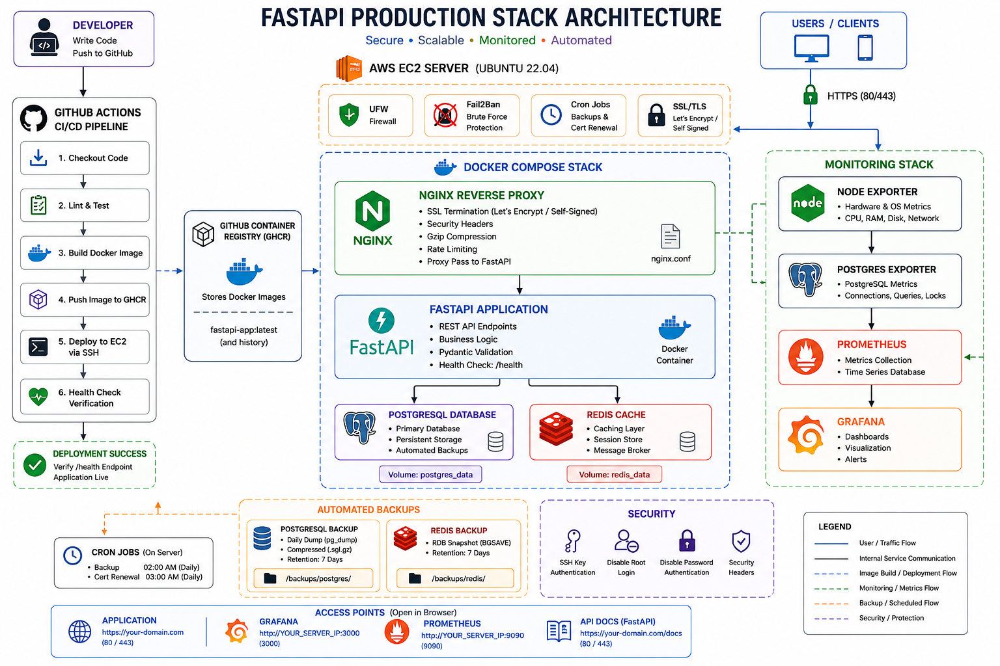
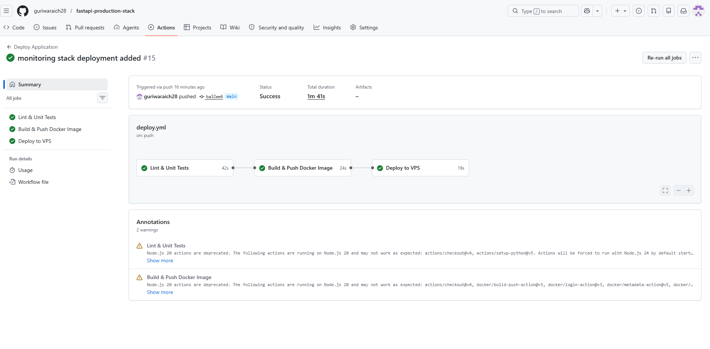
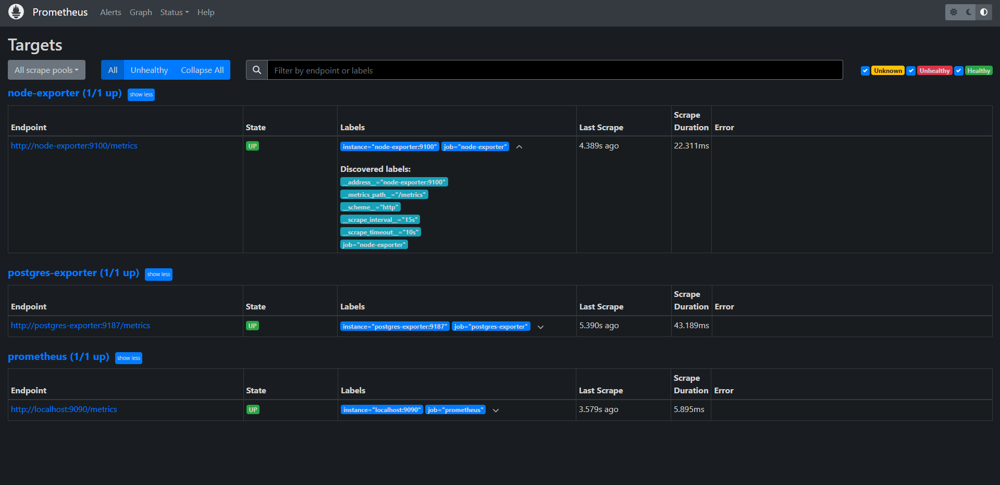
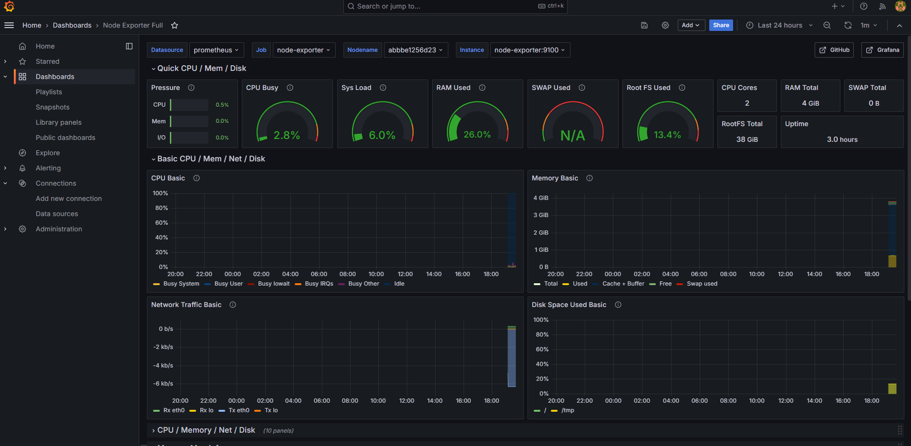

# FastAPI Production Stack

A production-ready FastAPI deployment stack demonstrating modern DevOps practices including containerization, reverse proxying, CI/CD, monitoring, security hardening, automated backups, and cloud deployment.

## 🎥 Deployment Walkthrough Video

Watch the full deployment walkthrough here:

[▶️ Watch Video](https://drive.google.com/file/d/1x4E0_o5ScDJO8t5grF0SXLTKVh-Begkc/view?usp=sharing)

---

## Architecture Overview



## Project Overview

This project was built as part of a DevOps Engineer technical assessment to demonstrate real-world deployment, infrastructure management, automation, monitoring, and operational reliability.

The stack includes:

* FastAPI Application
* PostgreSQL Database
* Redis Cache
* NGINX Reverse Proxy
* Docker & Docker Compose
* GitHub Actions CI/CD
* AWS EC2 Deployment
* Prometheus Monitoring
* Grafana Dashboards
* Automated Backups
* SSL Automation
* UFW Firewall
* Fail2Ban Intrusion Prevention

---

## Architecture

```text
                        GitHub Repository
                               │
                               ▼
                      GitHub Actions CI/CD
                               │
                               ▼
                    GitHub Container Registry
                               │
                               ▼
                          AWS EC2 VPS
                               │
                               ▼
                           NGINX
                               │
                               ▼
                           FastAPI
                           /      \
                          /        \
                         ▼          ▼
                    PostgreSQL    Redis


              ┌─────────────────────────┐
              │     Monitoring Stack    │
              └─────────────────────────┘

                Node Exporter
                       │
                       ▼
                  Prometheus
                       │
                       ▼
                    Grafana

                PostgreSQL Exporter
                       │
                       ▼
                  Prometheus
```

---

## Technology Stack

### Backend

* FastAPI
* Uvicorn
* Python 3.12

### Database

* PostgreSQL 16

### Cache

* Redis 7

### Reverse Proxy

* NGINX

### Containerization

* Docker
* Docker Compose

### CI/CD

* GitHub Actions
* GitHub Container Registry (GHCR)

### Cloud

* AWS EC2

### Monitoring

* Prometheus
* Grafana
* Node Exporter
* PostgreSQL Exporter

### Security

* UFW Firewall
* Fail2Ban
* SSH Key Authentication
* NGINX Security Headers

---

# Features

## Application Features

* FastAPI REST API
* Health Check Endpoint
* Environment-based Configuration
* PostgreSQL Integration
* Redis Integration

---

## Infrastructure Features

* Multi-container Docker Deployment
* Reverse Proxy with NGINX
* SSL Automation Support
* Automated Container Restart
* Persistent Storage Volumes

---

## DevOps Features

* Automated CI/CD Pipeline
* Docker Image Build Automation
* Container Registry Integration
* Automated VPS Deployment
* Health Verification After Deployment

---

## Monitoring Features

* Prometheus Metrics Collection
* Grafana Dashboards
* Node Exporter Metrics
* PostgreSQL Metrics
* Infrastructure Monitoring

---

## Security Features

* UFW Firewall
* Fail2Ban Protection
* SSH Key Authentication
* Security Headers
* Docker Security Options
* No-New-Privileges Containers

---

## Backup Features

* Automated PostgreSQL Backups
* Automated Redis Snapshots
* Backup Retention Policy
* Cron-based Scheduling

---

# Repository Structure

```text
.
├── app/
│   ├── main.py
│   ├── routers/
│   ├── models/
│   ├── services/
│   └── requirements.txt
│
├── nginx/
│   ├── nginx.conf
│   ├── conf.d/
│   └── certs/
│
├── monitoring/
│   ├── prometheus.yml
│   └── grafana/
│
├── postgres/
│   └── init.sql
│
├── scripts/
│   ├── backup.sh
│   ├── server-setup.sh
│   └── setup-ssl.sh
│
├── .github/
│   └── workflows/
│       └── deploy.yml
│
├── docker-compose.yml
├── docker-compose.monitoring.yml
├── .env.example
├── README.md
└── DEPLOYMENT.md
```

---

# Health Check

Endpoint:

```http
GET /health
```

Example Response:

```json
{
  "status": "healthy"
}
```

Used by:

* Docker Health Checks
* NGINX Validation
* CI/CD Deployment Verification

---

# CI/CD Pipeline

The deployment pipeline automatically executes on every push to the main branch.

### Workflow

1. Code Push
2. Lint & Validation
3. Unit Tests
4. Docker Image Build
5. Push Image to GHCR
6. SSH Into EC2
7. Pull Latest Image
8. Deploy Containers
9. Verify Health Endpoint

### GitHub Actions



Pipeline stages:

* Lint & Test
* Build & Push Docker Image
* Deploy to VPS
* Verify Deployment

---

# Monitoring

## Prometheus



Collects metrics from:

* Node Exporter
* PostgreSQL Exporter
* Prometheus

Access:

```text
http://SERVER_IP:9090
```

---

## Grafana



Visualizes infrastructure metrics.

Access:

```text
http://SERVER_IP:3000
```

Example Metrics:

* CPU Usage
* Memory Usage
* Disk Utilization
* Network Traffic
* PostgreSQL Metrics

---

# Security

The server is hardened using:

### UFW Firewall

Allowed Ports:

* 22 (SSH)
* 80 (HTTP)
* 443 (HTTPS)

### Fail2Ban

Protects against:

* SSH Brute Force Attacks
* Authentication Abuse

### SSH Security

* Password Login Disabled
* Key-based Authentication
* Root Login Disabled

---

# Backup Strategy

Backups are automated using cron jobs.

### PostgreSQL

* Daily Dumps
* Compressed Storage
* Retention Policy

### Redis

* RDB Snapshots
* Scheduled Backup

### Retention

Default:

```text
7 Days
```

---

# SSL Strategy

The project includes:

### Production

* Let's Encrypt
* Automated Renewal

### Development

* Self-Signed Certificates

SSL setup is handled through:

```bash
scripts/setup-ssl.sh
```

---

# Deployment

### Local Deployment

```bash
cp .env.example .env

docker compose up -d
```

---

### Monitoring Deployment

```bash
docker compose \
-f docker-compose.yml \
-f docker-compose.monitoring.yml \
up -d
```

---

### AWS EC2 Deployment

Deployment is automated through GitHub Actions.

Required Secrets:

* VPS_HOST
* VPS_USER
* VPS_PORT
* VPS_SSH_KEY
* GHCR_PAT

---


# Future Improvements

Potential enhancements:

* Cloudflare Integration
* Distributed Tracing
* Kubernetes Deployment
* Terraform Infrastructure Provisioning
* Managed Database Services
* Alertmanager Integration

---

# Author

Gurwinder Singh Waraich

GitHub:
https://github.com/guriwaraich28

---

# License

This project is provided for educational and demonstration purposes.
